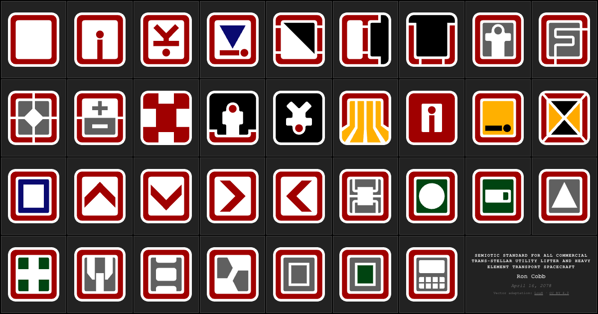

# SemioticStandard.org

[](https://semioticstandard.org/)
[](https://github.com/banastas/SemioticStandard.org/actions/workflows/validate.yml)
[](#local-development)

A minimalist, interactive reference for Ron Cobb's Semiotic Standard, the spacecraft symbol system created for *Alien* (1979).

<a href="https://semioticstandard.org/">
  
</a>

## About

The site presents 34 symbols: 30 numbered designs plus four directional and storage variants. The gallery keeps the artwork at the center of the experience with a full-viewport grid, black background, and a label that appears on hover, keyboard focus, or touch.

Visit [semioticstandard.org](https://semioticstandard.org/) to explore the gallery.

## Features

- 34 optimized SVG symbols in a responsive, full-viewport grid
- Exact factor-pair layouts that avoid partial or empty grid rows
- Native button controls with hover, focus, touch, Enter, Space, and Escape support
- Screen-reader labels, a live status region, visible focus states, and reduced-motion support
- Canonical metadata, Open Graph and X cards, JSON-LD, robots.txt, and an image sitemap
- Deferred Google Analytics that does not block the initial render
- Content security, transport security, privacy, and immutable asset-cache headers
- No runtime dependencies, frameworks, package installation, or build step

## Local development

The project is plain HTML, CSS, and JavaScript. Serve the repository root with any static server:

```bash
git clone https://github.com/banastas/SemioticStandard.org.git
cd SemioticStandard.org
python3 -m http.server 8000
```

Then open [http://localhost:8000](http://localhost:8000).

Run the repository integrity checks with Node.js 20 or newer. There is nothing to install:

```bash
npm test
```

The checks confirm the symbol count, labels, source files, SVG view boxes, metadata, security policy, screenshot dimensions, and local README links.

## How it works

The 34 symbols plus the two-column credit card occupy 36 effective grid cells. The layout script evaluates the exact factor pairs of 36 and selects the pair that produces the most nearly square cells for the current viewport. Typical layouts are:

| Viewport | Grid |
| --- | ---: |
| Phone portrait | 4 × 9 |
| Tablet or square | 6 × 6 |
| Desktop landscape | 9 × 4 |
| Extreme ultrawide | 12 × 3 |

The grid dimensions are exposed as the `--cols` and `--rows` CSS custom properties. CSS Grid handles the tracks, while a single delegated interaction layer manages all symbol labels.

## Project structure

```text
.
├── .github/workflows/validate.yml  # Dependency-free CI check
├── assets/
│   ├── css/style.css               # Layout, interaction, and responsive styles
│   ├── images/                     # 34 SVG symbols and the social preview
│   └── js/
│       ├── analytics.js            # Deferred analytics loader
│       └── script.js               # Grid selection and symbol interaction
├── scripts/check-site.mjs          # Repository integrity checks
├── _headers                        # CDN cache and security headers
├── favicon.svg
├── index.html
├── robots.txt
└── sitemap.xml
```

## Deployment

Deploy the repository root to any static host. No build command or environment variables are required. The `_headers` file is supported by hosts such as Cloudflare Pages and Netlify; reproduce those rules in the host configuration if another platform is used.

When the rendered gallery changes, refresh `assets/images/SemioticStandard.png` at 1200 × 630 so the README and social preview continue to match production.

## Accessibility

Each symbol is a native button with a descriptive accessible name. Keyboard focus reveals the same label as pointer hover, Escape dismisses it, and touch interaction toggles it. The gallery includes a skip link, a polite live region, high-contrast focus styles, and a reduced-motion mode.

## Credits

- [Ron Cobb](https://en.wikipedia.org/wiki/Ron_Cobb), creator of the Semiotic Standard
- [LouH's Semiotic Standard](https://github.com/louh/semiotic-standard), the vector adaptations used here, licensed under [CC BY 4.0](https://creativecommons.org/licenses/by/4.0/)
- [Brandon Gamm](https://thenounproject.com/gamm/collection/semiotic-standard-icons-from-alien/), whose icon recreations were the basis for LouH's adaptations
- Ridley Scott and the *Alien* production team, who brought the system into the film's visual world

## License

The website code is available under the [MIT License](LICENSE). The vector adaptations are provided under CC BY 4.0; see [Third-Party Notices](THIRD_PARTY_NOTICES.md) for attribution and details. The MIT license does not apply to those assets or relicense the underlying original artwork.

This project is an educational reference and tribute to Ron Cobb's design work.
